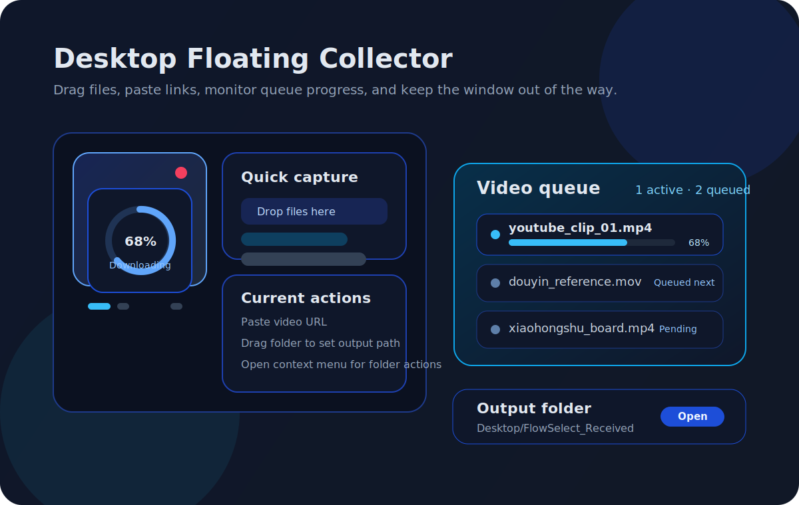
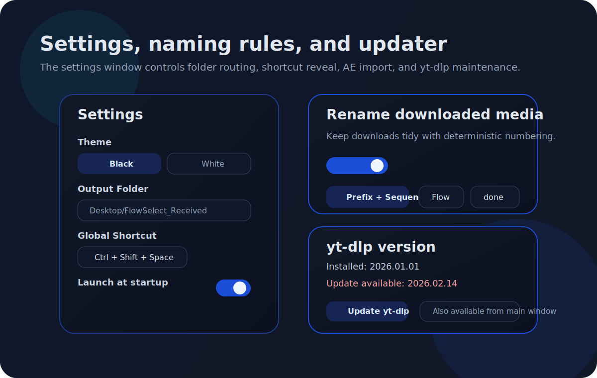
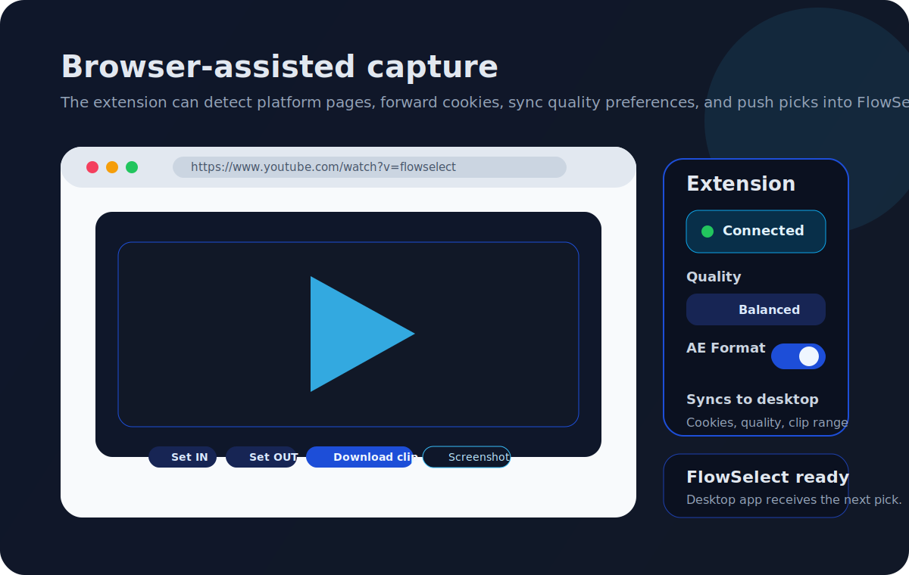
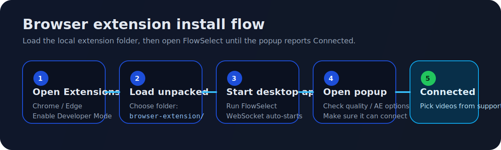

# FlowSelect

<div align="center">
  
  <p><strong>桌面悬浮素材收集器，面向文件、图片、网页视频与浏览器扩展联动。</strong></p>
  <p>
    <a href="./README.md">中文</a> |
    <a href="./README.en.md">English</a> |
    <a href="https://github.com/Wutpeach/FlowSelect/releases">下载 Releases</a> |
    <a href="./browser-extension/">浏览器扩展</a> |
    <a href="./release-notes/">Release Notes</a>
  </p>
  <p>
    
    
    
    
    
    
  </p>
</div>

FlowSelect 是一个基于 Electron 的轻量桌面素材收集工具，专门用来快速接收文件、图片和网页视频。它提供一个常驻桌面的悬浮窗口，支持拖拽、粘贴，以及可选的浏览器扩展联动，并将内容统一保存到可控的输出目录。

## 截图 / 界面预览

当前仓库还没有现成的录屏素材，下面先放基于当前产品结构整理的预览图，后续可以直接替换为真实截图或 GIF。

<p align="center">
  
  
</p>

<p align="center">
  
</p>

## 一眼看懂

| 方向 | 当前能力 |
| --- | --- |
| 收集入口 | 拖拽文件、拖拽文件夹、粘贴链接、Windows 剪贴板文件、浏览器扩展选取 |
| 视频流程 | 下载队列、实时进度、取消任务、最多 3 并发、直链优先、`yt-dlp` 回退 |
| 浏览器联动 | Cookies 透传、质量偏好同步、AE 偏好同步、YouTube 片段下载、截图保存 |
| 桌面体验 | 全局快捷键、系统托盘、开机启动、主题切换、右键输出目录菜单 |

## 适合的使用场景

- 想把桌面上的文件、图片和网页视频快速汇总到同一个目录。
- 需要一个常驻桌面、低打扰、不占主工作流的下载和收集入口。
- 会在浏览器里选视频，希望把 Cookies、质量偏好和下载动作同步到桌面端。
- 下载完成后还要继续进 After Effects 做剪辑或包装。

## 下载与安装

所有按钮都会跳转到 GitHub Releases 页面，请按平台选择对应产物。

### Windows

<p>
  <a href="https://github.com/Wutpeach/FlowSelect/releases/latest"></a>
  <a href="https://github.com/Wutpeach/FlowSelect/releases/latest"></a>
</p>

- `Installer EXE`: Electron Builder 生成的 Windows 安装包，适合常见分发场景。
- `Portable ZIP`: 免安装，解压即可运行。

### macOS

<p>
  <a href="https://github.com/Wutpeach/FlowSelect/releases/latest"></a>
  <a href="https://github.com/Wutpeach/FlowSelect/releases/latest"></a>
</p>

- `Apple Silicon DMG`: 适用于 M 系列芯片 Mac。
- `Intel DMG`: 适用于 Intel Mac。
- 当前 macOS 发布包采用开源 unsigned DMG 分发，不依赖 Apple Developer Program。
- 安装方式：
  1. 打开 DMG，把 `FlowSelect.app` 拖到 `Applications`。
  2. 从 `Applications` 打开 FlowSelect。
  3. 如果首次启动被 macOS 拦截，先尝试右键应用后选择“打开”，或前往 `系统设置 > 隐私与安全性` 放行。
- DMG 内会附带一份安装说明，包含可直接复制的手动修复命令。
- 高级手动修复命令：
  `xattr -dr com.apple.quarantine "/Applications/FlowSelect.app"`

## 核心能力

- 桌面悬浮收集窗口
  - 透明的 200x200 主窗口
  - 始终置顶
  - 空闲后自动缩成猫咪图标
- 快速收集流程
  - 拖拽本地文件到窗口，自动复制到输出目录
  - 拖拽文件夹到窗口，直接设置输出目录
  - 支持粘贴视频链接、图片链接和 data URL
  - 在 Windows 上支持粘贴剪贴板里的文件列表
- 视频下载流程
  - 内置下载队列、进度展示和取消能力
  - 最多支持 3 个视频任务并发
  - 对抖音、小红书直链优先走直连下载流程
  - 其他网页视频或回退场景交给 `yt-dlp`
- 输出控制
  - 默认保存路径为 `Desktop/FlowSelect_Received`
  - 可在设置页或右键菜单中修改输出目录
  - 可选下载重命名规则：
    - 倒序编号
    - 正序编号
    - 前缀 + 编号
- 桌面集成
  - 全局快捷键，可在鼠标附近显示或隐藏窗口
  - 开机启动
  - 系统托盘菜单
  - 黑白两套主题
  - 内置 `yt-dlp` 版本检查与更新入口
- After Effects 工作流
  - 下载完成后可选自动导入 After Effects
  - 浏览器扩展触发的视频下载可同步 AE 兼容格式偏好

## 配套浏览器扩展

仓库中同时包含一个 Manifest V3 浏览器扩展，位于 [`browser-extension/`](./browser-extension)。它面向 Chromium 内核浏览器，例如 Chrome 和 Edge。

当前已接入的网站包括：

- YouTube
- Bilibili
- X / Twitter
- Douyin
- Xiaohongshu

扩展当前提供的能力包括：

- 通过本地 WebSocket 连接桌面应用，地址为 `127.0.0.1:39527`
- 将选中的视频链接和浏览器 Cookies 发送给 FlowSelect
- 同步下载质量偏好：
  - `Highest`
  - `Balanced`
  - `Saver`
- 同步 AE 兼容格式偏好
- 站点侧辅助能力，例如：
  - 播放器内下载操作
  - YouTube 片段 IN/OUT 点下载
  - YouTube 和 Bilibili 截图捕获与保存

GitHub Releases 也会附带一个版本化扩展包：

- `FlowSelect_<version>_browser_extension.zip`
- 解压后，选择其中的 `browser-extension/` 目录执行 “Load unpacked”

## 架构概览

- [`src/`](./src)：React 前端，包含主悬浮窗、设置页和右键菜单窗口
- [`electron/`](./electron)：Electron 主进程与 preload bridge
- [`desktop-assets/`](./desktop-assets)：Electron 打包与下载运行时使用的图标、sidecar 源和运行时二进制资源
- [`browser-extension/`](./browser-extension)：配套浏览器扩展源码
- [`scripts/`](./scripts)：版本号更新、开发启动、便携包打包等脚本
- [`release-notes/`](./release-notes)：发布流程依赖的版本说明文件
- [`docs/electron-parity-verification.md`](./docs/electron-parity-verification.md)：Electron parity verification 与 release acceptance matrix

## 快速开始

### 环境要求

- Node.js 20+
- npm
- Python 3.13+（仅当你要本地构建 Pinterest sidecar 或复现 release 打包链路时）

### 安装依赖

```bash
npm install
```

### 启动开发环境

```bash
npm run dev
```

### 构建桌面应用代码

```bash
npm run build
```

### 打包桌面应用

Windows 安装包：

```bash
npm run package:win
```

Windows 便携包：

```bash
npm run package:portable
```

macOS 开源 unsigned DMG + ZIP：

```bash
npm run package:macos-open-source-dmg -- --arch x86_64
# 或
npm run package:macos-open-source-dmg -- --arch aarch64
```

常见产物路径：
- Windows 安装包：`dist-release/FlowSelect_<version>_windows_x64_installer.exe`
- Windows 便携包：`dist-release/portable/FlowSelect_<version>_windows_x64_portable.zip`
- macOS ZIP：`dist-release/FlowSelect_<version>_macos_<arch>.zip`
- macOS DMG：`dist-release/dmg/FlowSelect_<version>_macos_<arch>_installer.dmg`

如需单独打包浏览器扩展：

```bash
npm run package:browser-extension
```

- 默认产物路径：`dist/browser-extension/FlowSelect_<version>_browser_extension.zip`
- `npm run package:portable` 也会在 `dist-release/portable/` 额外产出同名扩展 ZIP，方便本地一起分发

### 常用检查命令

```bash
npm run lint
npm run type-check
npm run test
```

## 如何使用

1. 启动桌面应用。
2. 将文件、图片链接或视频链接拖入悬浮窗口。
3. 使用 `Ctrl+V` 或 `Cmd+V` 粘贴链接。
4. 在 Windows 上，也可以直接粘贴剪贴板中的文件。
5. 双击主窗口空白区域可以快速打开当前输出目录；右键主窗口仍可打开当前输出目录或重新选择输出目录。
6. 打开设置页后，可以管理主题、快捷键、开机启动、重命名规则、After Effects 集成和 `yt-dlp` 更新。

## 典型工作流

1. 打开 FlowSelect，让悬浮窗停在桌面边缘。
2. 在浏览器中复制链接、拖拽素材，或通过扩展直接选中视频。
3. FlowSelect 自动把文件保存到输出目录，并对视频任务进入队列管理。
4. 如果启用了重命名规则或 After Effects 联动，下载完成后会继续执行对应动作。

## 加载浏览器扩展

### 浏览器扩展安装示意

<p align="center">
  
</p>

1. 打开浏览器扩展管理页面。
2. 启用开发者模式。
3. 选择 “Load unpacked”。
4. 选中 [`browser-extension/`](./browser-extension) 目录，或者先从 GitHub Release 下载 `FlowSelect_<version>_browser_extension.zip`，解压后选中其中的 `browser-extension/` 目录。
5. 启动 FlowSelect 桌面应用。
6. 打开扩展弹窗，确认状态显示为 `Connected`。

## 仓库结构

```text
FlowSelect/
|-- src/                React UI
|-- electron/           Electron main/preload runtime
|-- desktop-assets/     Electron runtime assets and sidecar sources
|-- browser-extension/  Chromium extension
|-- scripts/            Dev and packaging helpers
|-- release-notes/      Versioned release notes
|-- README.md
`-- README.en.md
```

## 维护说明

- 更新版本号时，使用 `npm run version:set -- <version>`。
- 该命令会在缺少版本说明时，基于 `release-notes/TEMPLATE.md` 自动生成 `release-notes/v<version>.md` 草稿。
- 发布版本标签前，先补全并提交 `release-notes/v<version>.md`。
- GitHub Releases 由标签触发，Electron 发布链路会产出 Windows 安装包、Windows Portable ZIP、macOS ZIP、macOS DMG，以及 Windows `latest.json` 更新清单。
- 对应版本的 release note 文件必须已经存在于被打标签的提交中。
- GitHub Releases 还会附带 `FlowSelect_<version>_browser_extension.zip`，用于分发浏览器扩展更新。
- parity gate 与 cleanup 验证矩阵见 [`docs/electron-parity-verification.md`](./docs/electron-parity-verification.md)。
- 公开仓库只包含产品源码与发布文件；私有 AI / Trellis 工作流配置不会随仓库公开。
